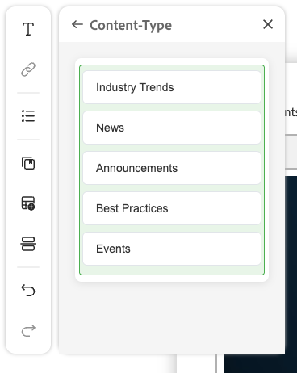

# DA Library Plugin

## Example UI


*Example: The plugin displays a list of content types fetched from a JSON source. Clicking an item sends the formatted value to the DA interface.*

## Overview

**da-library** is an interim solution for integrating and using legacy `.da/config.json` plugins within the new DA platform. This plugin allows you to fetch and render lists of items from JSON sources, and send formatted values back to the DA interface. It is designed to bridge the gap while migrating from the old plugin system to the new DA SDK-based approach.

## Purpose

- Provide compatibility for existing `.da/config.json` plugin data sources.
- Allow users to select and send formatted values (key, value) from JSON lists.
- Support flexible formatting via a URL parameter.

> NOTE: This plugin only supports key value json reponses.

## How It Works

- Fetches a JSON file from either:
  - **Relative paths**: DA Source API (e.g., `/docs/library/authors.json`)
  - **Full URLs**: Any external JSON API (e.g., `https://api.example.com/data/authors.json`)
- Renders the items as a selectable list in the UI.
- When an item is clicked, sends a formatted value (based on the `format` parameter) back to the DA interface and closes the plugin.

### URL Types

- **Relative paths** (starting with `/`): Use authenticated DA Source API access
- **Full URLs** (starting with `http://` or `https://`): Use standard fetch requests

## Usage

### Configuration

> Site _CONFIG_ > _library_

| title | path | icon | ref | format | experience |
| ------- | --------------------------------------------------------------------------------------------------------- | - | - | - | - |
| `Name`  | `/tools/plugins/da-library/da-library.html?content=/path/to/file.json&format=%3ACONTENT%3A` |   |   |   |   |


### Basic URL (Relative Path)

```
da-library.html?content=/docs/library/authors.json
```

- This will fetch the authors list from the DA Source API and allow you to select and send the raw key value.

### Basic URL (Full URL)

```
da-library.html?content=https://api.example.com/data/authors.json
```

- This will fetch the authors list from any external JSON API and allow you to select and send the raw key value.

### Using the `format` Parameter

You can customize the value sent by providing a `format` parameter in the URL. Use the placeholder `CONTENT` to indicate where the item's key should be inserted.

#### Example: Add a comma after each value `CONTENT,`

```
da-library.html?content=/docs/library/content-type.json&format=CONTENT%2C
```

#### Example: Custom attribute format `data-bi-bhvr = 'CONTENT'`

```
da-library.html?content=/docs/library/content-type.json&format=data-bi-bhvr%20%3D%20%27CONTENT%27
```

#### Example: Colon-wrapped format `:CONTENT:`

```
da-library.html?content=/docs/library/content-type.json&format=%3ACONTENT%3A
```

#### Example: Double curly braces format `{{CONTENT}}`

```
da-library.html?content=/docs/library/content-type.json&format=%7B%7BCONTENT%7D%7D
```

#### URL Encoding Reference

- `%2C` = comma `,`
- `%20` = space ` `
- `%3D` = equals sign `=`
- `%27` = single quote `'`
- `%3A` = colon `:`
- `%7B` = opening curly brace `{`
- `%7D` = closing curly brace `}`

### Result

- Clicking an item will send the formatted value (e.g., `data-bi-bhvr = 'news'`) to the DA interface and close the plugin.

## Limitations

- This is an interim solution and may be deprecated as the DA SDK and plugin system evolve.
- Only supports simple list selection and formatting.
- The placeholder for replacement is always `CONTENT` (case-sensitive).

## Migration

For long-term solutions, migrate your plugins to use the new DA SDK and recommended plugin architecture.

---

**Maintainer:** Adobe Team Blackbird 